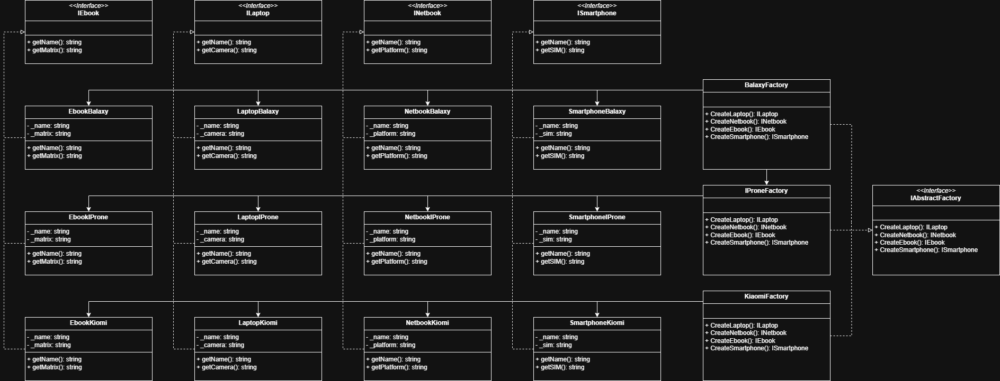

## Diagram


## Output
```
== AbstractFactory.Factories.BalaxyFactory ==
   ┌─ Laptop
   │   Name: Laptop by Balaxy
   │   Camera: FullHD
   ├─ Ebook
   │   Name: EBook by Balaxy
   │   Matrix: Kaleido
   ├─ Smartphone
   │   Name: Smartphone by Balaxy
   │   SIM: Nano
   ├─ Netbook
   │   Name: Netbook by Balaxy
   └─  Platform: iOS

== AbstractFactory.Factories.IProneFactory ==
   ┌─ Laptop
   │   Name: Laptop by IProne
   │   Camera: HD
   ├─ Ebook
   │   Name: EBook by IProne
   │   Matrix: Carta
   ├─ Smartphone
   │   Name: Smartphone by IProne
   │   SIM: Micro
   ├─ Netbook
   │   Name: Netbook by IProne
   └─  Platform: Linux

== AbstractFactory.Factories.KiaomiFactory ==
   ┌─ Laptop
   │   Name: Laptop by Kiaomi
   │   Camera: 4K
   ├─ Ebook
   │   Name: EBook by Kiaomi
   │   Matrix: Pearl
   ├─ Smartphone
   │   Name: Smartphone by Kiaomi
   │   SIM: Mini
   ├─ Netbook
   │   Name: Netbook by Kiaomi
   └─  Platform: Bimbows
```