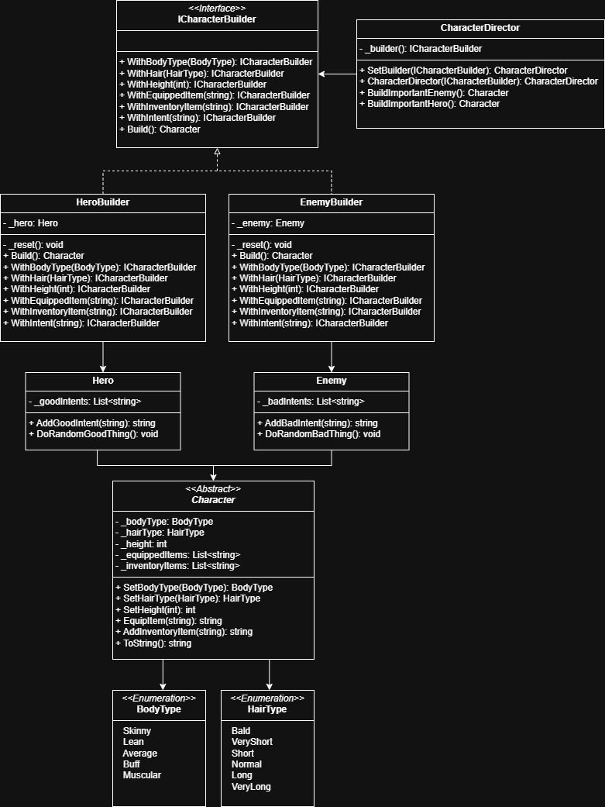

## Diagram


## Output
```
  == Hero ==
┌ Body Type: Buff
│ Hair Type: Short
│ Height: 187
│ Equipped Items: [sword_exoblade, helmet_spectre]
└ Inventory Items: [potion_greater_healing]

Hero is going to Save the village.

  == Enemy ==
┌ Body Type: Skinny
│ Hair Type: Normal
│ Height: 170
│ Equipped Items: [staff_vortex, robe_forbidden]
└ Inventory Items: [potion_greater_mana]

Enemy is going to Burn the village.
```